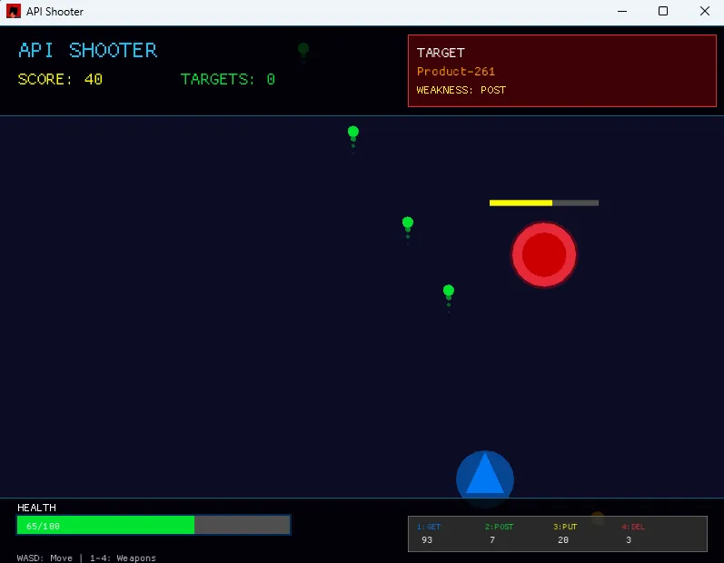

# API Shooter Game

A simple action game where you shoot enemies using HTTP methods. Built with Rust.

# Screenshots

<p align="center">
  
  <br>
  <em>Main gameplay - scan enemies and attack with HTTP methods</em>
</p>

## What is this?

Shoot enemies with GET, POST, PUT, DELETE attacks. Each enemy has a weakness to a specific HTTP method - find it and exploit it for critical damage.

## Quick Start

```bash
# Clone and run
git clone https://github.com/your-username/api-shooter-cli.git
cd api-shooter-cli
cargo run
```

## Controls

- **WASD**: Move
- **1**: GET (scan enemy weakness)
- **2**: POST (attack)
- **3**: PUT (strong attack)  
- **4**: DELETE (ultimate, limited ammo)
- **ESC**: Quit

## How to Play

1. Use GET (1) to reveal enemy weakness
2. Attack with the weakness for critical hits
3. Dodge incoming HTTP error attacks
4. Defeat enemies to progress

## Dependencies

- [macroquad](https://macroquad.rs/) (MIT/Apache-2.0) 
- [rand](https://crates.io/crates/rand) (MIT/Apache-2.0)

## License

[MIT License](./LICENSE)

